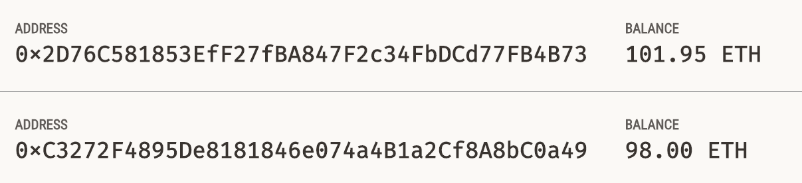

# 21st_Challenge

## Summary of Purpose  
---

I simulated a crowdsale for a block-chain fungible token.

To create this block-chain, I used my code inside of the Remix IDE & in conjunction with apps called Ganache & MetaMask.  

I also set the mining difficulty to 0, making this simulated block-chain very light-weight on my computer.  
I was able to make this simulation free-of-charge.  

If you just want to see sample usuage, look at the screenshots below.

---
## Required/Compatible Technologies
---
If you want to actually use the chain, continue reading this section.

**Compatible OS's:**   
    Mac, Windows, or Linux    
**Programming language:**   
    Solidity (filetype: .sol)  
**Required libraries/installations:**    

```
import "./KaseiCoin.sol";
import "https://github.com/OpenZeppelin/openzeppelin-contracts/blob/release-v2.5.0/contracts/crowdsale/Crowdsale.sol";
import "https://github.com/OpenZeppelin/openzeppelin-contracts/blob/release-v2.5.0/contracts/crowdsale/emission/MintedCrowdsale.sol";

import "https://github.com/OpenZeppelin/openzeppelin-contracts/blob/release-v2.5.0/contracts/token/ERC20/ERC20.sol";
import "https://github.com/OpenZeppelin/openzeppelin-contracts/blob/release-v2.5.0/contracts/token/ERC20/ERC20Detailed.sol";
import "https://github.com/OpenZeppelin/openzeppelin-contracts/blob/release-v2.5.0/contracts/token/ERC20/ERC20Mintable.sol";

```
Download & install Ganache.  
Open Ganache and hit the quickstart ethereum button.  

Download this github repo.  
Go to remix.ethereum.org  

Upload the the 2 .sol files.  
Double-click them in the file-tree to open them.  
Click the compile icon on the left side of the screen. Switch the compiler to v0.5.5 .
For each file, select it & click the compile button.  
Click the deploy icon on the left side of the screen.  
Make sure the "Environment" is set to injected MetaMask.
Make a MetaMask network by copy-pasting the Ganache RPC server and using the 1337 Network ID.
Import the accounts you want to use from Ganache into MetaMask by clicking the import button in the MetaMask extension (you can get it from the extension store in Chrome) and then pasting the private keys of the accounts you want to import.  
Connect those accounts to Remix using MetaMask.  
Choose the beneficiary of the crowdsale funds by switching the "Account" at the top.
Make sure the selected contract is "KaseiCoinCrowdsaleDeployer".  
Hit deploy.  
Hit the expand arrow under the "Deployed Contracts" section.  
Press the blue buttons to get the addresses of the KaseiCoin and KaseiCoinCrowdsale contracts.
Copy-paste those one-at-a-time into the "At Address" field above & be sure to fill out the constructor parameters.
Hit the expand arrows under the "Deployed Contracts" section. 
You can play with the functions there to test the contracts.  
You can also change the address calling the contract near the top of the deploy panel.  

Using the local network through Ganache should ensure you will not be charged for testing the chain.

---
## How to just View the Code
---
You can view it on this github repository.  
You can also use a code editor that supports Solidity (.sol files), e.g. Remix or VSCode.

If you want to actually play with the chain, read the previous section.

---


---
## Contributors
---
Noah Saleh

email: noahgsaleh@gmail.com

---
## Screenshots of Sample Usuage
---
### Compilation


  
 


### Deployment


  


## Transaction 1
  
 

The direct receipient is the contract, but the tokens get sent to account 4 and the raised wei eventually gets sent to the owner of the contract as you will see soon in the "Balances" section.
The 1st transaction was sent by the contract owner, who was the beneficiary of all wei raised.  
So essentially the owner paid himself 10 ETH on behalf of account 4, and account 4 got 10 free KS Tokens.

## Transaction 2


The 2nd transaction was sent by account 4. 
So essentially account 4 paid 2 ETH for 2 KS Tokens.
"nickname" is the nickname I gave to the contract, which again is the direct receipient.

### Updated Balances

 


So essentially the 2 ETH was transferred from account 4 to account 3. The slight discrepencies are due to gas fees. The 10 wei transaction didn't actually really do anything other than gas fees because it was just the owner paying himself.

 

I didn't get a screenshot of the Token-balance in Ganache because Ganache doesn't have a feature for tokens.
I didn't get a screenshot of the Token-balance in MetaMask because it was acting weird.  
I ran the issue by my teacher Eric, and he couldn't figure it out so he told me to tell you not to worry about it.


## Totals Supply & Wei Raised

 


---
### Note on This Repo's Title  
---
Here's why this repo is considered my 21st_Challenge:

There was no 8th or 9th challenge because my 1st group project took place of those 2 challenges.   
Similarly, my 2nd group project took place of 2 more challenges (challenges 16 & 17).  
So this repo is technically my 17th challenge because 21 - (2+2) = 17.  
I just called it "21st_Challenge" for convenience, based on the structure of the coding cource I took.